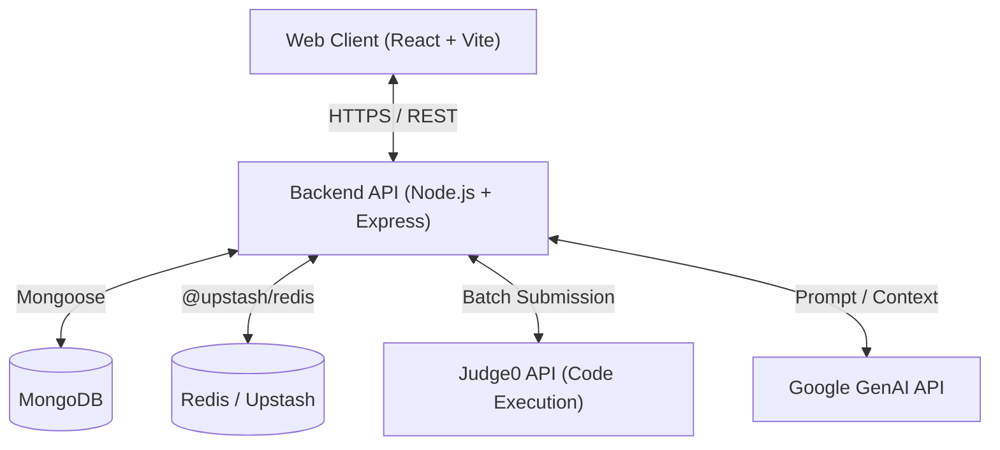

# CodeMaster: High-Level Design (HLD) Architecture

This document provides a high-level architectural overview of the **CodeMaster** platform, a LeetCode-clone MERN stack application.

## 1. System Overview

CodeMaster is a scalable, cloud-ready web application that allows users to solve algorithmic problems, compile code in multiple languages, get AI assistance, and track their progress. It consists of a React-based client, a Node.js API server, a MongoDB persistent storage layer, a Redis caching/rate-limiting layer, and third-party integrations for Code Execution (Judge0) and AI (Google GenAI).

---

## 2. Component Architecture

### 2.1. Frontend (Client Layer)
The frontend is designed as a Single Page Application (SPA) focusing on high performance and a rich developer experience.

*   **Framework**: React.js with Vite for rapid bundling.
*   **State Management**: Redux Toolkit (managing User Auth states).
*   **Styling**: TailwindCSS & DaisyUI.
*   **Code Editor**: Monaco Editor (`@monaco-editor/react`), providing VS Code-like intellisense and syntax highlighting.
*   **Key Modules**:
    *   **Workspace**: Integrates Problem Description, Editor, Test Cases, and AI Chat in a single view (`ProblemPage.jsx`).
    *   **Admin Dashboard**: Dedicated CRUD UI for managing problems and uploading solution videos.

### 2.2. Backend (API Layer)
The backend acts as the orchestrator. It handles authentication, data validation, and acts as a proxy for external services to prevent exposing API keys on the client.

*   **Framework**: Node.js & Express.js.
*   **Architecture Pattern**: MVC (Controllers, Models, Routes, Middleware).
*   **Deployment Target**: Configured for Vercel Serverless Functions (`vercel.json`), establishing DB connections dynamically on request (`src/index.js`).
*   **Core Services**:
    *   **User Auth**: JWT-based stateless authentication.
    *   **Submission Engine**: Constructs the final runnable code (injecting user code into hidden driver code) and batches test cases to send to Judge0.
    *   **AI Service**: Proxies user questions and problem context to Google GenAI for hints and complexity analysis.

### 2.3. Data Storage (Persistence Layer)
*   **Database**: MongoDB (managed via Mongoose).
*   **Schemas**:
    *   `User`: Authentication details, roles, and a list of solved problems.
    *   `Problem`: Problem statement, constraints, visible test cases, hidden test cases, and language-specific driver code.
    *   `Submission`: Tracks code, language, execution time, memory, passed test cases, and status (Pending/Accepted/Wrong).
    *   `SolutionVideo`: Maps external video links (or Cloudinary URLs) to specific problems.

### 2.4. Code Execution Engine
CodeMaster offloads the dangerous task of running arbitrary user code to a secure, isolated sandbox environment.

*   **Service**: **Judge0** API.
*   **Flow**:
    1.  User submits code.
    2.  Backend fetches driver code (e.g., hidden `main()` function) and injects the user's logic.
    3.  Backend creates a batch of submissions mapping to the hidden test cases.
    4.  Code is sent to Judge0 (`submitBatch`).
    5.  Backend polls Judge0 for results (`submitToken`).
    6.  Results (Runtime, Memory, Status) are aggregated and saved to the `Submission` collection.

### 2.5. Rate Limiting & Caching
To prevent abuse (e.g., a user spamming the "Run Code" button) and protect system resources, a rate limiter is enforced.

*   **Service**: Upstash (Serverless Redis).
*   **Implementation**: `submitRateLimiter` middleware intercepts submission requests, checks the user's IP/ID against Redis keys, and blocks requests if the threshold is exceeded.

---

## 3. Security Considerations

*   **Code Isolation**: User code is never executed on the Node.js API server; it is strictly offloaded to Judge0.
*   **Authentication**: Protected routes require valid JWT tokens passed via HttpOnly cookies or Authorization headers.
*   **Admin Guards**: Endpoints modifying global problem state or videos enforce Admin-role middleware.

## 4. Future Scalability (Next Steps)
As the platform grows, the following architectural upgrades can be considered:

1.  **WebSockets (Socket.io)**: For real-time multiplayer coding (mock interviews) or instant submission updates (eliminating Judge0 polling delays).
2.  **Message Queue (RabbitMQ / BullMQ)**: For async submission handling if the platform experiences high traffic spikes (e.g., during a contest).
3.  **CDN / Object Storage**: Utilizing AWS S3 or Cloudinary for hosting static assets and uploaded video solutions.
